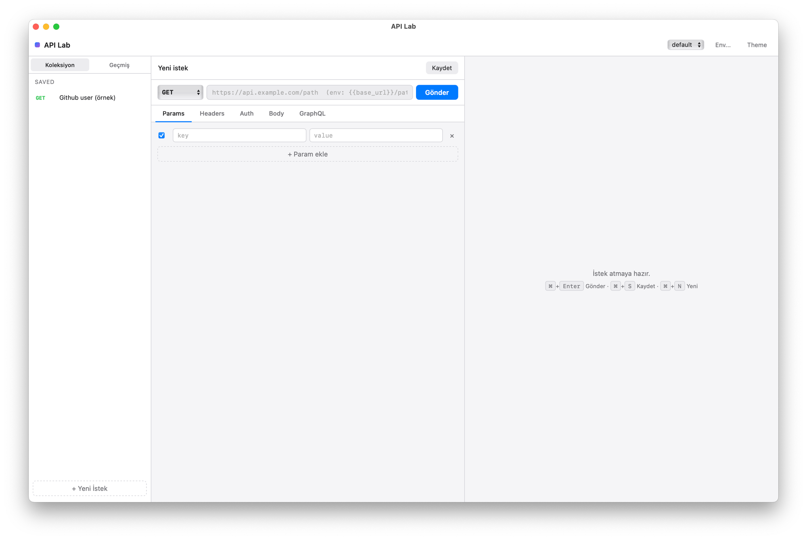

# API Lab

A tiny native macOS API tester. Postman-style request composer, native HTTP transport via `curl` subprocess (CORS-free), under **3 MB** binary, instant cold start.

Built on top of **[vercel-labs/zero-native](https://github.com/vercel-labs/zero-native)** — a Zig-based native shell for web UIs (WebKit on macOS, WebKitGTK on Linux, WebView2 on Windows). Pure HTML / CSS / JS frontend, no build pipeline, no npm.



## Features

- **REST + GraphQL** request composer with method picker, params/headers/auth tabs, JSON/form/raw body modes
- **Native HTTP** transport via Zig bridge → `curl` subprocess (bypasses WebView CORS, supports any endpoint)
- **Browser fetch fallback** for environments without the native bridge
- **Auth helpers** — Bearer, Basic, API Key (header), more pluggable
- **Environments** with `{{var}}` substitution
- **Collections** + history (last 200 requests) — persisted via `localStorage`
- **JSON syntax highlighting**, response timing, headers viewer, copy-as-cURL
- **Apple-style UI** — dark mode (auto), Cmd+Enter / Cmd+S / Cmd+N shortcuts, resizable layout
- **3-pane layout** — sidebar (collections/history), composer, response viewer

## Quick start

Prerequisites:
- **Zig 0.16+** (`brew install zig`)
- **`curl`** (preinstalled on macOS)
- **OrbStack** or Docker Desktop (the `dnpm` wrapper builds the frontend in a hardened container; npm never runs on your host — see `frontend/CLAUDE.md` for the threat model)
- **`dnpm`** wrapper (`~/.local/bin/dnpm`)

```bash
# Clone both repos as siblings — build.zig defaults to ../zero-native
git clone https://github.com/vercel-labs/zero-native.git
git clone https://github.com/olgunozoktas/api-lab.git

# Build the React frontend in the secure dnpm sandbox
cd api-lab/frontend
dnpm install                # one-time, then again whenever package.json changes
dnpm run build              # produces /app/dist inside the volume
dnpm sync-dist              # copy dist/ + .astro/ from the volume to the host

# Build + run the native shell
cd ..
zig build run               # window opens at 1280×800; sample request preloaded
```

If your `zero-native` checkout lives elsewhere:

```bash
zig build run -Dzero-native-path=/path/to/zero-native
```

### Why two build steps?

- The frontend (Vite + React + Tailwind v4) builds inside a hardened Linux container with no Docker socket, dropped capabilities, network-off rebuild phase, and read-only project mount. Malicious npm packages cannot reach your home directory.
- `dnpm sync-dist` is required because `frontend/dist/` lives in a Docker named volume by default; the Zig native shell needs the artifacts on the host filesystem to serve them via the `zero://app` asset handler.

For dev (HMR via Vite):

```bash
cd frontend && dnpm run dev   # starts Vite at 127.0.0.1:5173
# In another terminal:
ZERO_NATIVE_FRONTEND_URL=http://127.0.0.1:5173/ zig build run
```

### Build size

```
$ ls -lh zig-out/bin/api-lab
2.9M  zig-out/bin/api-lab
```

For comparison: Postman 200+ MB, Insomnia 150+ MB.

## Architecture

```
api-lab/
├── app.zon                  # zero-native manifest, permissions, security policy
├── build.zig                # Zig build, links zero-native + WebKit
├── src/
│   ├── main.zig             # bridge dispatcher + WebView source (zero://app assets)
│   ├── runner.zig           # zero-native runner (platform pickers + lifecycle)
│   ├── handlers/
│   │   └── http.zig         # native HTTP handler — curl subprocess, JSON in/out
│   └── index.html           # full UI (single file, vanilla JS, ~40 KB)
└── assets/
    └── icon.icns
```

### Bridge contract

The frontend calls `window.zero.invoke("http.request", payload)` where:

```ts
// payload
{
  method: "GET" | "POST" | "PUT" | "PATCH" | "DELETE" | "HEAD" | "OPTIONS",
  url: string,
  headers: { name: string; value: string }[],
  body: string | null,
  timeout_ms: number,        // default 60_000
  follow_redirects: number,  // default 10
  insecure: boolean          // default false (skip TLS verify)
}

// response
{
  status: number,
  size_bytes: number,
  timing_ms: number,
  timing: {
    namelookup_ms: number,
    connect_ms: number,
    ttfb_ms: number,
    total_ms: number
  },
  url: string,        // effective URL after redirects
  headers: { name: string; value: string }[],
  body: string,
  // on failure:
  error?: string,
  exit_code?: number,
  stderr?: string
}
```

The bridge policy in `main.zig` requires the `network` permission and `zero://app` origin. Each command is policy-checked before dispatch.

## Roadmap

This is a Phase 1 MVP. Future phases:

- **Phase 2** — WebSocket support, code generation (curl/fetch/python/go), better timing visualization
- **Phase 3** — gRPC via `grpcurl` subprocess, server reflection, proto file picker
- **Phase 4** — Pre-request + test scripts (sandboxed)
- **Phase 5** — Postman v2 / OpenAPI 3 import, themes, settings page

## Built with [zero-native](https://github.com/vercel-labs/zero-native)

API Lab is a thin layer on top of vercel-labs/zero-native. Why zero-native fits here:

- **Tiny binaries** — 2.9 MB vs Electron's ~100 MB baseline
- **Zig-native** — direct C interop, fast cold start, modern memory safety
- **Real WebKit** — no bundled Chromium, uses the platform WebView (`WKWebView` on macOS)
- **Bridge model** — JS↔Zig with explicit policy + permissions, untrusted-by-default WebView

All credit for the native shell, runtime, and bridge dispatcher goes to the zero-native team. This project demonstrates what you can build on top of it.

## License

MIT — see [LICENSE](./LICENSE).
